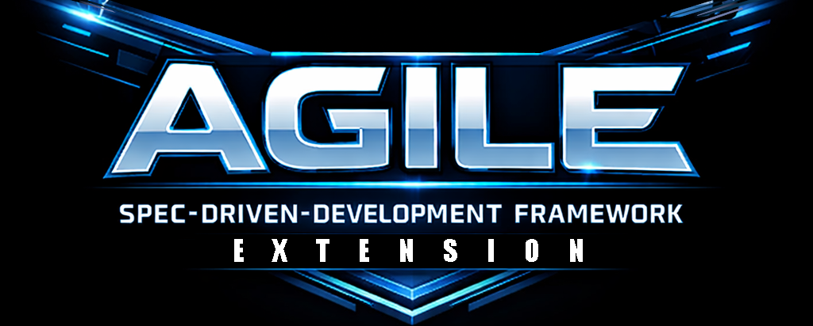

# agile-sddf-extension
Public repository of agent skills to extend agile-sddf

## Available Skills

### Implementation

- **`code-backend-nestjs`** — NestJS best practices and architecture patterns for production-ready applications
- **`code-frontend-library-react`** — React UI library components: CSS pure + BEM + design tokens, TypeScript strict, tsup, Turborepo

### Testing

- **`test-playwright-cucumber`** — E2E tests (E2E) with Cucumber BDD + Playwright (feature files, step definitions, hooks, CI/CD)
- **`test-cypress-cucumber`** — E2E tests (E2E) with Cucumber BDD + Cypress (feature files, step definitions, hooks, CI/CD)
- **`test-nestjs-jest-testing-module`** — Unit tests (UT) for NestJS apps using the Testing Module and Jest
- **`test-nestjs-supertest`** — API integration tests (API/IT) for NestJS with Supertest (routing, guards, pipes, DB isolation)
- **`test-react-testing-library`** — React components tested (CT) with Vitest + Testing Library + happy-dom + axe-core

### Utilities

- **`changelog-generator`** — Generate release notes from git commits, updates, or feature lists

### OpenSpec support

- **`openspec-generate-baseline`** — Reverse-engineers an OpenSpec baseline from existing code and docs (README/AGENTS)
- **`openspec-init-config`** — Initializes/updates OpenSpec project context from README.md, CLAUDE.md, AGENTS.md

## Installation

**For end users** (using npx):
```bash
npx skills add dariopalminio/agile-sddf-extension --skill my-skill
```

Full GitHub URL:
```bash
npx skills add https://github.com/dariopalminio/agile-sddf-extension --skill my-skill
```

Install all skills from a repository:
```bash
npx skills add dariopalminio/agile-sddf-extension --all
```

| Flag | Description |
|------|-------------|
| `-s, --skill <skills...>` | Install only specific skills by name (e.g. `--skill code-backend-nestjs`). Use `*` to install all skills in the repository. |
| `-l, --list` | List all available skills in a repository without installing them |

## Repository Structure
```
agile-sddf-extension/
├── skills/
│   └── <skill-name>/             # kebab-case, e.g. code-backend-nestjs
│       ├── SKILL.md              # REQUIRED main file
│       ├── scripts/              # (Optional) Executable scripts
│       ├── references/           # (Optional) Supporting documentation
│       ├── assets/               # (Optional) Static files used by the skill
│       └── lib/                  # (Optional) Shared code for scripts
├── template/
│   └── SKILL.md                  # Base template for new skills
├── spec/
│   └── agent-skills-spec.md      # Skill specification
├── AGENTS.md                     # Guide for AI agents working in the repo
├── README.md                     # Main repository documentation
└── .gitignore
```

## Creating or Contributing a Skill

Skill conventions, the required frontmatter, and the contribution checklist live in [AGENTS.md](AGENTS.md) — read that file before adding or modifying a skill.
