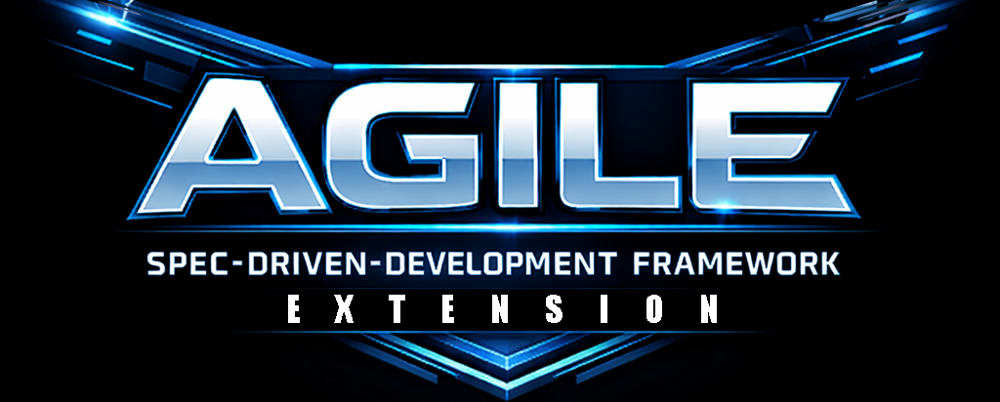

# agile-sddf-extension
Public repository of agent skills, guardrails and policies to extend agile-sddf

## Available Skills

### Meta-framework of skills

- **`skill-master`**: creates and benchmarks new skills with an iterative cycle — `skill-master` orchestrates the complete creation flow;

- **`skill-test-evals`**: manages the lifecycle of evals (generate, execute, benchmark) with three modes: `generate` (creates `evals/evals.json` + skeleton SKILL.md from free description or existing SKILL.md), `evals` (1 run → pass/fail report with evidence) and `benchmark` (N runs × case → statistical metrics mean ± stddev);

### Documents

- **`doc-guardrail-creator`** — Create a guardrail file for one domain: rules split into deterministic (tool + rule id + error/warn) and semantic (AI / human review)
- **`doc-policy-creator`** — Create a `<domain>-policy.md`: guardrails, best practices and operational directives that govern AI agents in one SDD domain
- **`doc-release-notes`** — Generate changelog and release notes (user-facing + technical) from git commits, updates, or feature lists

### UX/UI Design

- **`ui-generate-design-md`** — Create or update a DESIGN.md (design tokens + UI rules) from a product repository or a public website

### Implementation

- **`code-backend-nestjs`** — NestJS best practices and architecture patterns for production-ready applications
- **`code-frontend-library-react`** — React UI library components: CSS pure + BEM + design tokens, TypeScript strict, tsup, Turborepo

### Testing

- **`test-playwright-cucumber`** — E2E tests (E2E) with Cucumber BDD + Playwright (feature files, step definitions, hooks, CI/CD)
- **`test-cypress-cucumber`** — E2E tests (E2E) with Cucumber BDD + Cypress (feature files, step definitions, hooks, CI/CD)
- **`test-nestjs-jest-testing-module`** — Unit tests (UT) for NestJS apps using the Testing Module and Jest
- **`test-nestjs-supertest`** — API integration tests (API/IT) for NestJS with Supertest (routing, guards, pipes, DB isolation)
- **`test-react-testing-library`** — React components tested (CT) with Vitest + Testing Library + happy-dom + axe-core

### OpenSpec support

- **`openspec-generate-baseline`** — Reverse-engineers an OpenSpec baseline from existing code and docs (README/AGENTS)
- **`openspec-init-config`** — Initializes/updates OpenSpec project context from README.md, CLAUDE.md, AGENTS.md

## Installation

**For end users** (using npx):
```bash
npx skills add dariopalminio/agile-sddf-extension --skill my-skill
```

Full GitHub URL:
```bash
npx skills add https://github.com/dariopalminio/agile-sddf-extension --skill my-skill
```

Install all skills from a repository:
```bash
npx skills add dariopalminio/agile-sddf-extension --all
```

| Flag | Description |
|------|-------------|
| `-s, --skill <skills...>` | Install only specific skills by name (e.g. `--skill code-backend-nestjs`). Use `*` to install all skills in the repository. |
| `-l, --list` | List all available skills in a repository without installing them |

## Installing Guardrails

Guardrails are standalone Markdown files, not skills: `npx skills add` does not install them. Each
one is self-contained — copy the file into your project and it works, with no companion skill or
script to fetch alongside it.

| Guardrail | Domain |
|-----------|--------|
| `skill-creation.md` | Creating and reviewing Agent Skills |
| `test-cypress-cucumber.md` | E2E BDD suites with Cypress + Cucumber |
| `test-playwright-cucumber.md` | E2E BDD suites with Playwright + Cucumber |

**One guardrail** — download it straight into your project:

```bash
mkdir -p guardrails
curl -fsSL -o guardrails/skill-creation.md \
  https://raw.githubusercontent.com/dariopalminio/agile-sddf-extension/main/guardrails/skill-creation.md
```

**All of them** — a sparse checkout fetches the folder without cloning the rest of the repository:

```bash
git clone --depth 1 --filter=blob:none --sparse \
  https://github.com/dariopalminio/agile-sddf-extension.git .sddf
git -C .sddf sparse-checkout set guardrails
mkdir -p guardrails && cp .sddf/guardrails/*.md guardrails/ && rm -rf .sddf
```

**Then wire it up.** A guardrail only takes effect when agents are told to read it, so add a pointer
in your `AGENTS.md` (or `CLAUDE.md`) — this repository does the same:

```markdown
## Guardrails
- For detailed guidelines on skill creation, see [guardrails/skill-creation.md](guardrails/skill-creation.md).
```

Each guardrail carries a *How to run the validation* section whose commands are copyable as written;
wire those into CI to enforce the deterministic layer, and review the semantic checklist on the PR.

## Repository Structure
```
agile-sddf-extension/
├── agents/
├── guardrails/
│   └── <domain>.md               # Standalone rule files (deterministic + semantic)
├── policies/
│   └── <domain>-policy.md        # Governance documents
├── skills/
│   └── <skill-name>/             # kebab-case, e.g. code-backend-nestjs
│       ├── SKILL.md              # REQUIRED main file
│       ├── scripts/              # (Optional) Executable scripts
│       ├── references/           # (Optional) Supporting documentation
│       ├── assets/               # (Optional) Static files used by the skill
│       └── lib/                  # (Optional) Shared code for scripts
├── template/
│   └── SKILL.md                  # Base template for new skills
├── spec/
│   └── agent-skills-spec.md      # Skill specification
├── AGENTS.md                     # Guide for AI agents working in the repo
├── README.md                     # Main repository documentation
└── .gitignore
```

## Crear una nueva skill

* **Creation skill**

```bash
# Ciclo iterativo de creación y benchmarking
/skill-master
```

* **Running Tests**

El framework no tiene suite de tests automatizados para el pipeline principal. La calidad de los skills se valida con el meta-skill `skill-master` mediante ejecución paralela (con skill vs sin skill) y un viewer HTML de benchmarking:

```bash
/skill-master
```

## Creating or Contributing a Skill

Skill conventions, the required frontmatter, and the contribution checklist live in [AGENTS.md](AGENTS.md) — read that file before adding or modifying a skill.
